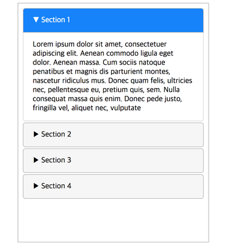

# 20181001 Mon
## 시계 완성

- 오늘 목표
  - codewars 알고리즘 문제 1개
  - 아코디언 만들기 
  - 표준형 웹사이트 강의 28-33강
 

- 오늘 마감
  - 시계 만들기
 

- 오늘 리뷰
목표와 전혀 다른거 했네ㅋ.ㅋ
아침에 수영갔다가 점심을 길게 먹고 들어와서, 실업급여 무슨 강의도 듣고 하느냐고 시간이 많이 없었다 
강의 같은거 듣다가 숙제 못할까봐 주말반에서 배우던거 상기시키면서 시계 만들었다

실시간 시분초 변하는 시스템.
숙제 하나 해서 뿌듯!!!
 

# 20181002 TUE
## 스탑워치, 아코디언 만들기 시도

- 오늘 목표
  - 스탑워치 만들기 
 

- 오늘 마감
  - 스탑워치 만들다 보류 
  - 아코디언 만들다 보류 
 

- 오늘 리뷰
어제 시계를 성공해서 스탑워치도 비슷하게 하다보면 되겠지 싶었는데 생각보다 복잡해서... 하다가 때려쳤당 
그리고 아코디언 html, css 부분까지 짜고 자바스크립트 하다가 또 막혀가지고 일단 접음! 
내일 다시 하는걸로
 

# 20181003 WED
## 아코디언 완성 / 알고리즘 1문제 / 표준형사이트강의 4개

- 오늘 목표
  - 아코디언 만들기
 

- 오늘 마감
  1. 알고리즘 문제 1개 풀었음 -> 6kyu에 가장 많이 푼 문제? 눌렀더니 쉬웠다
  [6kyu) Multiples of 3 or 5](http://choinashil.blog.me/221370467108) : 간단한 for문
 

  2. 표준형 웹사이트 강의 27강~30강까지 들음 
hover에 대해 했는데, 어제 고생했던 display: none, block이 왜 애니메이션 안먹는지에 대해 나옴
바로 밑에 3번을 미리 썼는데, 이 강의를 먼저 봤더라면 어제 고생을 덜 했겠지,,?
 

  3. 아코디언 만듬! 코드가 깔끔하지 않아서 마음에 안들지만.. 디자인적으로는 최대한 노력함 
밑에 요게 내가 만든건데 섹션 클릭하면, 화살표 모양 바뀌고, 탭 칼라 바뀌고, 내용이 스르륵 하면서 열리는거 ! 
어제까지 자꾸 display: none, block 으로 하려니 안되서 고생했는데 overflow: hidden 으로 해결!
display는 애니메이션 안 먹는다는걸 이번 기회에 알게됨

 

- 오늘 리뷰
알고리즘이랑 강의듣는것도 해야되는데 자꾸 만드는거에만 빠져있다,,!!!!
라고 쓰고는, 아코디언 완성하고 잘 시간까지 시간이 조금 있어서 쉬운 알고리즘 후딱 하나 풀고 HTML/CSS 강의도 들었다 ! 
목표치만큼은 채우지 못하고있지만 그래도 역시 하루에 할일을 다 하니 뿌듯!
내일은 스탑워치를 꼭 완성하자!
 
